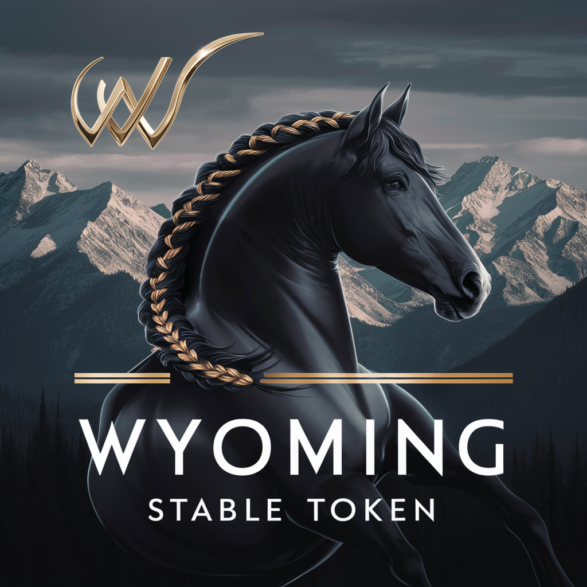

# Introduction to the WEST Protocol

## GOALS
The Goals of the WEST Token are to create:
* The fastest token in the world and complete transactions in less than half a second. 
* The most scalable token in the world and will handle all the transactions it is given. 
* The most energy efficient token in the world and will use less electricity than a house.
* The most private token in the world with no user accounts, passwords and user-identifying information.
* The most legal token in the world because it is actual cash and can follow all existing cash laws.
* The easiest token to use.
* The most bankable token that supports a strong banking industry. 
* The most quantum safe token.
* The most inexpensive as it requires no fees. 
* The token with the most ability to mitigate the risk of theft and loss.
* The only token that provides accountability so that system administrators can’t steal without being noticed. 

The WEST will be the only stable token in the world that separates data from logic so that:  
* “smart contract” bugs are impossible.
* It is the first “crossover currency” and can go between reality and virtual reality.
* ”Turing complete” and usable by all computer programming languages.
* It can be stored in any datafile
* It can be transported using any transportation method. 
* It can be easily stored in a person’s mind where it is undetectable.  
* It can easily be integrated with existing ATM systems

The WEST token has optional features including: 
* Easy to implement smart contracts system
* Active Directory Administration
* Loss Recovery of Coins

In addition, in the future,  the WEST Protocol can be used to support: 
* Quantum safe key exchange systems to replace the SSL/TLS Protocols that are not quantum safe. 
* Quantum safe encrypted communications using any type of protocols such as HTTP, SMS, DNS, FTP.
* Compression of protocols like the ones above so they use less bandwidth and download much faster
* The striping and sharding of data so that it too has data supremacy. 
* The WEST Tokens can also be used as cryptographic keys, identifiers, and certificates. 
* Can hold state documents such as those dealing with Legislation, Regulation, Administration, Financial, Legal and Court Records, Licenses, Permits, Education, Health, Land, Property, Historical, PUblic Safety, Emergency Services and so much more. 

## TRUE CASH
To reach its goals, the WEST Protocol creates a true digital cash token where the data of the monetary system is not stored centrally (like in a ledger) but is physically located on the computing devices of the people who own the tokens. 
Just as cash is stored in wallets and purses, digital cash token is stored in files located on USB drives and Smartphones. 

Suppose that I have a file called a WEST Token. This file has a serial number and dozens of authenticity numbers in it. If I physically have the file, then I am the owner because I know the authenticity numbers. 
If I want to buy something from you, I will give you the file. Now we both have the numbers. 
Anyone with the numbers can change them by going to 25 servers located all around Wyoming. 
Once you have changed the numbers, the token is now yours because I no longer know the numbers and only you no the numbers. 

We call a group of computers that do the same work but have completely different data and are run by different organizations "RAIDA".

## Meaning of "RAIDA"
In 1985, the US government created a RAIDA (redundant array of independent DNS authorities), commonly called the "root servers" so that people could refer to computers by a name and not a number. 
Instead of us being required to type a number like “189.98.226.16” into a web browser, we can now simply type in something easier to remember like “www.wyoming.gov”. 
We all use this system thousands of times daily without even knowing it. 
The DNS RAIDA plays an essential role in keeping the Internet working. 
If the DNS RAIDA was to be hacked, it could bring down the entire Internet. 
This system is scalable to the entire planet, is extremely fast and is free for everyone. 

The properties of the RAIDA can also be used to detect counterfeit tokens. We place one RAIDA node in each county, one in the capital city and one in they University of Wyoming. 
Each node is indepedently opperated so that there is no systemic risk of failure. 

## Conventions

### TRANSPORT PROTOCOLS (UDP/TCP)
The protocol supports both UDP and TCP. It is up to the client to decide which one. Generally, we have designed the requests so that they can fit into one 1400-byte packet so that these packet. 
As a rule, if you are going to need to send one packet then you should use UDP. If you are going to use more than 

### AUTHENTICITY NUMBERS
Autheticity Numbers are sixteeen bytes and are created by the Clients. Clients should use a different ANs for each RAIDA so there is no way that RAIDA Admins can know the ANs that are on other RAIDA. 

### FILES FORMAT
The format for the coins is a binary file format that is founded under L. File Formates. 

 [1] Cash is defined as a currency or token whose database’s data is stored with the owner of the data. Coins and paper money are data stored in the pockets of their owners. WEST stores data on the computers, smart phones and USB drives of their owners. 
