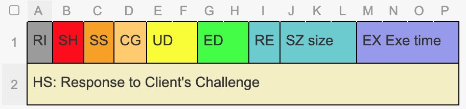

# Response Headers
Response Headers are 
* always 32 bytes long.
* never encrypted.
* Have 10 parts:

Part No. | code | Name | Byte Count
---|---|---|---
  1 |RI|Responding RAIDA ID | 1
  2 | SH|Responding Shard ID | 1
  3 |SS|Response Status| 1
  4 |CG|Command Group| 1
  5 |UD|UDP Frame Count| 2
  6 |CE|Client's echo| 2
  7 |EX| Extensible| 1
  8 |SZ| Bytes in Body| 3
  9 |ET|	Execution Time in Nano Seconds| 4
  10 |HC|	Challenge Response | 16

Response Header layout (32 bytes fixed):

```
   00 01 02 03 04 05 06 07 08 09 0A 0B 0C 0D 0E 0F
00 RI SH SS CG UD UD EC EC RE SZ SZ SZ EX EX EX EX
01 HS HS HS HS HS HS HS HS HS HS HS HS HS HS HS HS
```

## Response Header Codes
Index | Code | Name | Info
--- |---|---|---
00 |RI | RAIDA ID  |  Integer 0 through 24. If the response is from RAIDA 3 it will be 3
01 |SH | SHARD ID  |  Zero unless sharding is implemented
02 |SS | Status  | That status code that is returned. See return [Status](#status-codes) codes.   
03 |CG | [Command Group](https://github.com/worthingtonse/RAIDAX/blob/CBDC/Request%20Headers.md#command-groups) | This may effect the meaning of the status. See the group codes. 
04 |UD | UDP Frame Count 0  |  This allows the client to know how to put the returned packets together in order. 
05 |UD | UDP Frame Count 1 |  Lower Order Byte.
06 |EC | Client Echo 0 | Returns exact info that Client supplied in the Request Header.  
07 |EC | Client Echo 1 | last byte of the request header.
08 |RE | Reserved | Reserved for future use. Use zero for now.
09 |SZ | Size of body 0 |  The length in bytes of the response packet excluding the Response Header. Only used with...
10 |SZ | Size of body 1 |   TCP. (This is not needed with UDP)
11 |SZ | Size of body 2  |  
12 |EX  | Execution Time  0 | Nano seconds the RAIDA needed to process the request. Up to 4,294,967,295...
13 |EX  | Execution Time 1  | helps evaluation server performance.
14 |Ex |  Execution Time 2 |  
15 |Ex | Execution Time 3  |  
16 |HS | Signature 0 | 16 bytes Client's challenge is XOR'ed with the Encyption AN.
17 |HS | Signature 1 | 1. Take the clients challenge and unencrypt it.
18 |HS | Signature 2| 2. XOR the unencrypted challenge with the AN used to encrypt it. 
19 |HS | Signature 3| 3. Put this in the Header. 
20 |HS | Signature 4| Example: 
21 |HS | Signature 5| Challenge is eb159806b4024f65af86dc25edbe3a1d
22 |HS | Signature 6| Encryption AN is 66689ef5bde040479416b4f6d9576172
23 |HS | Signature 7| XOR is 8d7d06f309e20f223b9068d334e95b6f
24 |HS | Signature 8| 
25 |HS | Signature 9| 
26 |HS | Signature A| 
27 |HS | Signatuee B|
28 |HS | Signature C| 
29 |HS | Signature D| 
30 |HS | Signature E| 
31 |HS | Signature F| 


## STATUS CODES


### All-Command Header Errors
Name | Code | Description
---|---|---
  NO_ERROR | 0 | No error
  ERROR_INVALID_CLOUD_ID | 1 |  
  ERROR_INVALID_SPLIT_ID | 2 |
  ERROR_INVALID_RAIDA_ID | 3 | 
  ERROR_INVALID_SHARD_ID | 4 | 
  ERROR_INVALID_COMMAND_GROUP | 5 |
  ERROR_INVALID_COMMAND | 6 | Command or command group not found
  ERROR_INVALID_TOKEN_ID | 7 | CoinID is not supported by this RAIDA
  ERROR_INVALID_UDP_FRAME_COUNT | 15 | 
  ERROR_INVALID_PACKET_LENGTH | 16 | Packet length is too small 
  ERROR_UDP_FRAME_TIMEOUT | 17 | 
  ERROR_WRONG_RAIDA | 18 | The request is sent to the wrong raida
  ERROR_SHARD_NOT_AVAILABLE | 20 | 
  ERROR_ENCRYPTION_TOKEN_NOT_FOUND | 25 | 
  ERROR_INVALID_ENCRYPTION_CODE | 27 | 
  ERROR_INVALID_EOF | 33 | Two last bytes can't be found 0xff 0xff
  ERROR_INVALID_ENCRYPTION | 34 | 
  ERROR_EMPTY_REQUEST | 36 | 
  ERROR_INVALID_CRC | 37 | CRC32 in the challenge doesn't match
  ERROR_ADMIN_AUTH | 38 | Wrong admin key
  ERROR_TOKENS_NOT_DIV | 39 | The number of tokens in the request is not multiple of the reqired number
  ERROR_INVALID_SN_OR_DENOMINATION | 40 | Invalid serial nummber of denomination
  ERROR_PAGE_IS_NOT_RESERVED | 41 | 
  ERROR_NO_TICKET_SLOT | 42 | 
  ERROR_NO_TICKET_FOUND | 43 | 
  ERROR_TICKET_CLAIMED_ALREADY | 44 | Ticket has been used
  ERROR_TOO_MANY_TOKENS | 45 | The server can't process so many tokens
  ERROR_INVALID_SHARD | 46 | Invalid shard. We only support 0 until future use
  ERROR_DELETE_TOKENS | 47 | Failed to delete legacy tokens
  ERROR_LEGACY_DB | 48 | Problems with MySQL
  ERROR_INVALID_KEY_START | 195 | Invalid keyStart parameter
  ERROR_INVALID_KEY_LENGTH | 196 | Invalid keyLength parameter
  ERROR_TOKEN_LOAD | 197 | Failed to load RAIDA encryption token
  ERROR_INVALID_PARAMETER | 198 | Invalid parameter passed to the service
  ERROR_INVALID_PAN | 199 | 
  STATUS_FIND_NEITHER | 208 | Find: Neither
  STATUS_FIND_ALL_AN | 209 | Find: ALL_AN. The ANs were all good. 
  STATUS_FIND_ALL_PAN | 210 | Find: ALL_PAN. The PANs were all good.
  STATUS_FIND_MIXED | 211 | Find: Mixed. Some ANs were good. 
  STATUS_ALL_PASS | 241 | All tokens are authentic
  STATUS_ALL_FAIL | 242 | All tokens are counterfeit
  STATUS_MIXED | 243 | Mixed response
  STATUS_SUCCESS | 250 | Common success status for all commands
  ERROR_INTERNAL | 252 | Internal error
  ERROR_NETWORK | 253 | Network error
  ERROR_MEMORY_ALLOC | 254 | Memory allocation error
  ERROR_INVALID_ROUTING | 255 | Routing in the request header is not supported

				           

# Authentication Statuses
Code | Meaning
---|---
00 | All Failed
01 | All Success
02 | Mixed Results
26 | Coin limit exceded

# Heath Statuses
Code | Meaning
---|---
200 | All Failed
201 | All Success
202 | Mixed Results
21 |Validate - Ticket found				       
22 |Validate - Ticket not found			     
23 |Validate - Invalid Raida     	
26 |Coin limit exceded			 	  	  
37 |Validate - Ticket claimed earlier  
38 | Validate - Ticket claimed	
208 |Find all none	
209 | Find all AN				
210 |Fnd  all PA		
211 | Find mixed			
90 |Fix All Tickets Zero  
31 | Packet is lost or re-ordered	
32 |Len Of body Cant Div in tokens		    


# RKE Statuses
Code | Meaning
---|---
200 | Failed: Key not found.
201 | Sucess: Key Returned	           
40 | Free ID: SN already in use			     
41 | Free ID: Service Locked	          
42 |Free ID: SN was not in range
192 | Identify token found					            
193 | identify token not found				         
28 | Key Requester SN was not found	 	  		
28 | Key Requester AN was not found 		
30 | Pown - AN and PAN are Same					  

<!--

# Idea About Uniform Statuses 

<style type="text/css">
.tg  {border-collapse:collapse;border-spacing:0;}
.tg td{border-color:black;border-style:solid;border-width:1px;font-family:Arial, sans-serif;font-size:14px;
  overflow:hidden;padding:10px 5px;word-break:normal;}
.tg th{border-color:black;border-style:solid;border-width:1px;font-family:Arial, sans-serif;font-size:14px;
  font-weight:normal;overflow:hidden;padding:10px 5px;word-break:normal;}
.tg .tg-0pky{border-color:inherit;text-align:left;vertical-align:top}
</style>
<table class="tg">
<thead>
  <tr>
    <th class="tg-0pky">Group Code</th>
    <th class="tg-0pky">Group</th>
    <th class="tg-0pky">Command Code<br></th>
    <th class="tg-0pky">Code</th>
    <th class="tg-0pky">Status</th>
    <th class="tg-0pky">Description</th>
  </tr>
</thead>
<tbody>
  <tr>
    <td class="tg-0pky" rowspan="9">0</td>
    <td class="tg-0pky" rowspan="4">Status</td>
    <td class="tg-0pky">00</td>
    <td class="tg-0pky">Echo</td>
    <td class="tg-0pky">01</td>
    <td class="tg-0pky">Success</td>
  </tr>
  <tr>
    <td class="tg-0pky" rowspan="2">01</td>
    <td class="tg-0pky" rowspan="2">Show Stats</td>
    <td class="tg-0pky">01</td>
    <td class="tg-0pky">Success</td>
  </tr>
  <tr>
    <td class="tg-0pky">00</td>
    <td class="tg-0pky">Failed: Authentication </td>
  </tr>
  <tr>
    <td class="tg-0pky">02</td>
    <td class="tg-0pky">Audit Coins</td>
    <td class="tg-0pky">01</td>
    <td class="tg-0pky">Success</td>
  </tr>
  <tr>
    <td class="tg-0pky" rowspan="5">Request Header</td>
    <td class="tg-0pky">00</td>
    <td class="tg-0pky">100</td>
    <td class="tg-0pky">100</td>
    <td class="tg-0pky">Failed Something</td>
  </tr>
  <tr>
    <td class="tg-0pky"></td>
    <td class="tg-0pky"></td>
    <td class="tg-0pky"></td>
    <td class="tg-0pky"></td>
  </tr>
  <tr>
    <td class="tg-0pky"></td>
    <td class="tg-0pky"></td>
    <td class="tg-0pky"></td>
    <td class="tg-0pky"></td>
  </tr>
  <tr>
    <td class="tg-0pky"></td>
    <td class="tg-0pky"></td>
    <td class="tg-0pky"></td>
    <td class="tg-0pky"></td>
  </tr>
  <tr>
    <td class="tg-0pky"></td>
    <td class="tg-0pky"></td>
    <td class="tg-0pky"></td>
    <td class="tg-0pky"></td>
  </tr>
  <tr>
    <td class="tg-0pky" rowspan="13">1</td>
    <td class="tg-0pky" rowspan="13">Authentication</td>
    <td class="tg-0pky" rowspan="3">10</td>
    <td class="tg-0pky" rowspan="3">Detect</td>
    <td class="tg-0pky">00</td>
    <td class="tg-0pky">All Fail</td>
  </tr>
  <tr>
    <td class="tg-0pky">01</td>
    <td class="tg-0pky">All Success</td>
  </tr>
  <tr>
    <td class="tg-0pky">02</td>
    <td class="tg-0pky">Mixed</td>
  </tr>
  <tr>
    <td class="tg-0pky" rowspan="3">11</td>
    <td class="tg-0pky" rowspan="3">Detect Sum</td>
    <td class="tg-0pky">00</td>
    <td class="tg-0pky">All Fail</td>
  </tr>
  <tr>
    <td class="tg-0pky">01</td>
    <td class="tg-0pky">All Success</td>
  </tr>
  <tr>
    <td class="tg-0pky">02</td>
    <td class="tg-0pky">Mixed</td>
  </tr>
  <tr>
    <td class="tg-0pky" rowspan="3">12</td>
    <td class="tg-0pky" rowspan="3">Pown</td>
    <td class="tg-0pky">00</td>
    <td class="tg-0pky">All Fail</td>
  </tr>
  <tr>
    <td class="tg-0pky">01</td>
    <td class="tg-0pky">All Success</td>
  </tr>
  <tr>
    <td class="tg-0pky">02</td>
    <td class="tg-0pky">Mixed</td>
  </tr>
  <tr>
    <td class="tg-0pky" rowspan="3">13</td>
    <td class="tg-0pky" rowspan="3">Pown Sum</td>
    <td class="tg-0pky">00</td>
    <td class="tg-0pky">All Fail</td>
  </tr>
  <tr>
    <td class="tg-0pky">01</td>
    <td class="tg-0pky">All Success</td>
  </tr>
  <tr>
    <td class="tg-0pky">02</td>
    <td class="tg-0pky">Mixed</td>
  </tr>
  <tr>
    <td class="tg-0pky">14</td>
    <td class="tg-0pky">Identify</td>
    <td class="tg-0pky"></td>
    <td class="tg-0pky"></td>
  </tr>
  <tr>
    <td class="tg-0pky" rowspan="14">2</td>
    <td class="tg-0pky" rowspan="14">Healing</td>
    <td class="tg-0pky" rowspan="3">20</td>
    <td class="tg-0pky" rowspan="3">Get Ticket</td>
    <td class="tg-0pky">00</td>
    <td class="tg-0pky">All Fail</td>
  </tr>
  <tr>
    <td class="tg-0pky">01</td>
    <td class="tg-0pky">All Success</td>
  </tr>
  <tr>
    <td class="tg-0pky">02</td>
    <td class="tg-0pky">Mixed</td>
  </tr>
  <tr>
    <td class="tg-0pky" rowspan="2">21</td>
    <td class="tg-0pky" rowspan="2">Validate Ticket</td>
    <td class="tg-0pky">00</td>
    <td class="tg-0pky">Fail: No Ticket</td>
  </tr>
  <tr>
    <td class="tg-0pky">01</td>
    <td class="tg-0pky">Success SNs returned</td>
  </tr>
  <tr>
    <td class="tg-0pky" rowspan="4">22</td>
    <td class="tg-0pky" rowspan="4">Find</td>
    <td class="tg-0pky">00</td>
    <td class="tg-0pky">Failed: Neither Found</td>
  </tr>
  <tr>
    <td class="tg-0pky">01</td>
    <td class="tg-0pky">Mixed</td>
  </tr>
  <tr>
    <td class="tg-0pky">02</td>
    <td class="tg-0pky">All ANs Good</td>
  </tr>
  <tr>
    <td class="tg-0pky">03</td>
    <td class="tg-0pky">All PANs Good</td>
  </tr>
  <tr>
    <td class="tg-0pky" rowspan="5">23</td>
    <td class="tg-0pky" rowspan="5">Fix</td>
    <td class="tg-0pky">00</td>
    <td class="tg-0pky">Failed: No Ticket</td>
  </tr>
  <tr>
    <td class="tg-0pky">01</td>
    <td class="tg-0pky">All Success</td>
  </tr>
  <tr>
    <td class="tg-0pky">02</td>
    <td class="tg-0pky">Failed Not Enough Responses</td>
  </tr>
  <tr>
    <td class="tg-0pky">03</td>
    <td class="tg-0pky">Failed DNS issue</td>
  </tr>
  <tr>
    <td class="tg-0pky">04</td>
    <td class="tg-0pky">Failed Requests Blocked</td>
  </tr>
  <tr>
    <td class="tg-0pky" rowspan="8">3</td>
    <td class="tg-0pky" rowspan="8">Stable Coin</td>
    <td class="tg-0pky" rowspan="8">30</td>
    <td class="tg-0pky" rowspan="2">Get SNs</td>
    <td class="tg-0pky">00</td>
    <td class="tg-0pky">Failed</td>
  </tr>
  <tr>
    <td class="tg-0pky">01</td>
    <td class="tg-0pky">Success</td>
  </tr>
  <tr>
    <td class="tg-0pky" rowspan="3">Create Coins</td>
    <td class="tg-0pky">00</td>
    <td class="tg-0pky">All Failed</td>
  </tr>
  <tr>
    <td class="tg-0pky">01</td>
    <td class="tg-0pky">All Success</td>
  </tr>
  <tr>
    <td class="tg-0pky">02</td>
    <td class="tg-0pky">Mixed</td>
  </tr>
  <tr>
    <td class="tg-0pky" rowspan="3">Delete Coins</td>
    <td class="tg-0pky">00</td>
    <td class="tg-0pky">All Fail</td>
  </tr>
  <tr>
    <td class="tg-0pky">01</td>
    <td class="tg-0pky">All Pass</td>
  </tr>
  <tr>
    <td class="tg-0pky">02</td>
    <td class="tg-0pky">Mixed</td>
  </tr>
  <tr>
    <td class="tg-0pky" rowspan="10">4</td>
    <td class="tg-0pky" rowspan="10">Key Exchange</td>
    <td class="tg-0pky" rowspan="3">40</td>
    <td class="tg-0pky" rowspan="3">Encrypt Keys</td>
    <td class="tg-0pky">00</td>
    <td class="tg-0pky">Failed</td>
  </tr>
  <tr>
    <td class="tg-0pky">01</td>
    <td class="tg-0pky">Success</td>
  </tr>
  <tr>
    <td class="tg-0pky">11</td>
    <td class="tg-0pky">Offline</td>
  </tr>
  <tr>
    <td class="tg-0pky" rowspan="4">41</td>
    <td class="tg-0pky" rowspan="4">Notify</td>
    <td class="tg-0pky">00</td>
    <td class="tg-0pky">Failed: No Keys</td>
  </tr>
  <tr>
    <td class="tg-0pky">01</td>
    <td class="tg-0pky">Success</td>
  </tr>
  <tr>
    <td class="tg-0pky">02</td>
    <td class="tg-0pky">Failed Not Enough Responses</td>
  </tr>
  <tr>
    <td class="tg-0pky">03</td>
    <td class="tg-0pky">Failed to Decrypt</td>
  </tr>
  <tr>
    <td class="tg-0pky" rowspan="3">42</td>
    <td class="tg-0pky" rowspan="3">Unencrypt Keys</td>
    <td class="tg-0pky">00</td>
    <td class="tg-0pky">Fail</td>
  </tr>
  <tr>
    <td class="tg-0pky">01</td>
    <td class="tg-0pky">Success</td>
  </tr>
  <tr>
    <td class="tg-0pky">11</td>
    <td class="tg-0pky">Offline</td>
  </tr>
  <tr>
    <td class="tg-0pky">7</td>
    <td class="tg-0pky">Blockchain</td>
    <td class="tg-0pky"></td>
    <td class="tg-0pky"></td>
    <td class="tg-0pky"></td>
    <td class="tg-0pky"></td>
  </tr>
  <tr>
    <td class="tg-0pky" rowspan="6">8</td>
    <td class="tg-0pky" rowspan="6">Coin Locker</td>
    <td class="tg-0pky" rowspan="6">82</td>
    <td class="tg-0pky" rowspan="2">Store Sum</td>
    <td class="tg-0pky">00</td>
    <td class="tg-0pky">Failed</td>
  </tr>
  <tr>
    <td class="tg-0pky">01</td>
    <td class="tg-0pky">Success</td>
  </tr>
  <tr>
    <td class="tg-0pky" rowspan="2">Peek</td>
    <td class="tg-0pky">00</td>
    <td class="tg-0pky">Failed No Coins</td>
  </tr>
  <tr>
    <td class="tg-0pky">01</td>
    <td class="tg-0pky">Success</td>
  </tr>
  <tr>
    <td class="tg-0pky" rowspan="2">Remove</td>
    <td class="tg-0pky">00</td>
    <td class="tg-0pky">Fail</td>
  </tr>
  <tr>
    <td class="tg-0pky">01</td>
    <td class="tg-0pky">Success</td>
  </tr>
  <tr>
    <td class="tg-0pky"></td>
    <td class="tg-0pky"></td>
    <td class="tg-0pky"></td>
    <td class="tg-0pky"></td>
    <td class="tg-0pky"></td>
    <td class="tg-0pky"></td>
  </tr>
  <tr>
    <td class="tg-0pky"></td>
    <td class="tg-0pky"></td>
    <td class="tg-0pky"></td>
    <td class="tg-0pky"></td>
    <td class="tg-0pky"></td>
    <td class="tg-0pky"></td>
  </tr>
  <tr>
    <td class="tg-0pky"></td>
    <td class="tg-0pky"></td>
    <td class="tg-0pky"></td>
    <td class="tg-0pky"></td>
    <td class="tg-0pky"></td>
    <td class="tg-0pky"></td>
  </tr>
</tbody>
</table>


## How The UDP Works
UDP is used instead of TCP. The UDP protocol can be made to be much more reliable by following this protocol.

1. The first packet that you send will contain the 32 byte header. All following packets will not tokentain a header. 

2. Each packet will be no more than 1400 bytes long. This will keep the bytes from being seperated and arriving out of order. 

3. The Header Packet will contain the total amount of packets that are being sent in the 15th byte. 

4. There may not be any more than 64 packets sent in one request. 

5. It is up to the client to decide how many bytes each packet will have.

6. The last packet that is sent will contain the 0x3E 0x3E. These bytes may be used in the future or ECC purpose but are there now just as a place holder. 
-->
