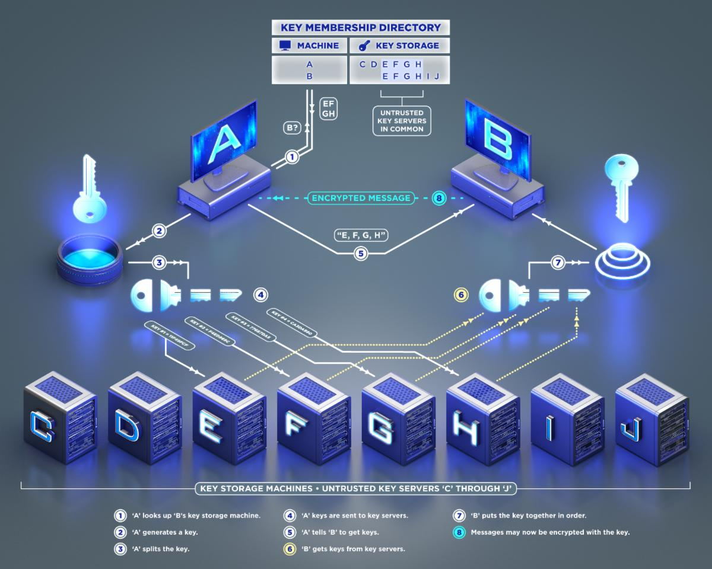

# Public Key Exchange

These services allows computers that do not share a common secret to trade keys. 
This is designed to be a quantum safe replacement for TLS/RSA.

Command Code | Service | Notes
---|---|---
41 | [Key Post]( #key-post) | Allows the Initiating Client to put key parts on the RAIDA
42 | [Key Alert](#key-alert) | Allows the Initiating Client to inform the Passive Server to pick up keys. 
43 | [Key Get](#key-get) | The Passive Server calls this service to receive the key parts
- | [Peer To Peer](#peer-to-peer_) | How computers who have exchanged keys can connect with each other. 

## KEY POST
The sender computer that wants to initiate an encrypted session with a receiver server will take a key and devide into parts. 
Then it will post each part on a different RAIDA.

It is the client that must handle the keys as the Post Key service has not logic besides storing data. 
See the Key Post Client Guidlines below for details. 

Each RAIDA can store 128 bytes of a key.

Byte Code | Name | Purpose
---|---|---
CH | Challenge | This is for mutual identification. The RAIDA server must decrypt this and return it with the response 
ID | Key ID | Client makes a random key ID. ID is needed for a direct connection. Client and reciver will need to store this. 
IP | Reciver's IP | The sender can specify that the reciver must have that IP address to get the key. (Optional. Zeros if empty)
DN | ID Denomination | If the client wants the receiver to authenticate, it can requre a denomination and serial number 
SN | ID Serial Number | Client can prove their identity by supplying this.
D3 | 
KY | The key Part | Can hold any data and keys up to 128 bytes ( 3.2 KB accross the entire RAIDA). 
KS | *Key Start | Because the fixed key space could be zeros if empty, the client may fill unused bytes with random numbers. This is the byte (indexed by zeros) that is the first byte of the key
KL | Key Length | This is the total number of bytes in the key and is used for finding the end of the key. 
E3 | End bytes | Specifies the end of the Request Body. Not encrypted. 

Sample Request: 185 bytes fixed.
```sql
CH CH CH CH CH CH CH CH CH CH CH CH CH CH CH CH  //Challenge
ID ID ID ID ID FU FU FU FU FU FU FU FU FU FU FU FU //Key ID (5 bytes) and 11 bytes for future use. 
IP IP IP IP IP IP IP IP IP IP IP IP I4 I4 I4 I4 //IP address of the computer to receive (Optional. Zeros if empty)
DN SN SN SN SN //Encryption Coin that Receiver should use to get the key (Optional. Zeros if empty)
KY KY KY KY KY KY KY KY KY KY KY KY KY KY KY KY //Key space. There are a fixed 128 bytes of key space in every post
KY KY KY KY KY KY KY KY KY KY KY KY KY KY KY KY //Key space. The key space is a bunch of random numbers.
KY KY KY KY KY KY KY KY KY KY KY KY KY KY KY KY //Key 
KY KY KY KY KY KY KY KY KY KY KY KY KY KY KY KY //Key 
KY KY KY KY KY KY KY KY KY KY KY KY KY KY KY KY //Key 
KY KY KY KY KY KY KY KY KY KY KY KY KY KY KY KY //Key 
KY KY KY KY KY KY KY KY KY KY KY KY KY KY KY KY //Key 
KY KY KY KY KY KY KY KY KY KY KY KY KY KY KY KY //Key 
KS //Key part start: A number between 0 and 127 that shows the index number in the key space where the first byte of the key is located.
KL //Key part Length: How many bytes long the key is. Must be 4, 8, 16, 24, 32 or 40. Other numbers are invalid
E3 E3  //Not Encrypted 
```
NOTE: The Key Start and the Key Length help to strengthen the encryption. It also reduces DOS 
attacks designed to use up system resource. The key used to encrypt the request will write over
any other requests it has made. Each encryption coin can only make one request at a time and is 
the Primary key in the RKE server's key table.

Response Status Codes
Code | Status | Details | Implemented Now?
---|---|---|---
0 | Fail | failed but no details provided | Yes
1| Success | Key posted successfuly | Yes
3 | Fail: Client's IP Address was zero. Anonymous clients not allowed. | No
4 | Fail: Receivers's IP Address was zeros. Anonymous receiver not allowed.| No
5 | Key Start was invalid. |Yes
6 | Key Length was invalid. | Yes
7 | Fail: Coin used for encryption was used too many times. | No
8 | Offline | Service temporarilty offline  | No

## ALERT KEY
Tells the Receiver that there are keys waiting for it. 
The client can use any combinations of RAIDA it wants to. It can use all 25 or just 2.
However, the reciever has the option of using a subset of the key parts that they Sender has suggested. 
This is because the Receiver may not trust all the RAIDA suggested. In this case, the client
will need to assemble the key parts in a different manner. 

Byte Code | Name | Purpose
---|---|---
CH | Challenge | This is for mutual identification. The server must decrypt this and return it with the response 
ID | ID | Hash of the key part that the client has created and stored on a RAIDA
IP | RAIDAs IP | This is the IP address that the key receiver must go to to download the key part. 
PT | RAIDAs Port | This is the port number the reciever will need to use to get the key part (RAIDA's port number) 
DN | Denomination | Used if the Receiver wants to authenticate the sender.  
SN | Serial Number | Client can prove their identity by supplying this.
E3 | End bytes | Specifies the end of the Request Body. Not encrypted. 

Sample Request (Unencrypted): 62 bytes for every key part plus two ending bytes. 
```sql
CH CH CH CH CH CH CH CH CH CH CH CH CH CH CH CH  
NU //THe number of key parts that have created. 
HS HS HS HS HS HS HS HS HS HS HS HS HS HS HS HS // A hash of the five byte Key ID used in the Key Post 
IP IP IP IP IP IP IP IP IP IP IP IP IP IP IP IP 
PT PT PT //IP and port number of the first RKE server
DN SN SN SN SN //Senders Encryption Coin (Optional)
DE SE SE SE SE //Coin Receiver should use to do the encryption. (Optional/future use)
--- The above four lines are repeated for every key part that the receiver is being told about. 
--- Maximum of 16 key parts. 
E3 E3 //Not Encrypted
```

Sample Response to Sender:
```sql
FF FF 00 FF 00 00 00 00 00 FF 00 00 00 00 00 00 //Byte fields showing which key parts were used. 
E3 E3  //Not Encrypted
```
Sample Response Body SHowing that key parts 0, 1 and 3 where used and key part. They must be put together in that order. 


# GET KEY
Allows a client to get a key on an RKE server that was left for them by a computer initiating a private conversation.  

Sample Request fixed size: 
```sql
CH CH CH CH CH CH CH CH CH CH CH CH CH CH CH CH 
HS HS HS HS HS HS HS HS HS HS HS HS HS HS HS HS // A hash of the five byte Key ID used in the Key Post 
DN  SN SN SN SN //The encryption ID of the key sender (Optional all zeros)
IP IP IP IP IP IP IP IP IP IP IP IP I4 I4 I4 I4 //IP address of the sender (Optional all zeros)
E3 E3  //Not Encrypted
```

Sample Respons fixed size: 
```hex
ID ID ID ID ID FU FU FU FU FU FU FU FU FU FU FU FU //Key ID (5 bytes) and 11 bytes for future use. 
DN  SN SN SN SN //The encryption ID of the key sender (Optional) 
IP IP IP IP IP IP IP IP IP IP IP IP I4 I4 I4 I4 (optoinal) Allows the server to prepare for a connection.
E3 E3  //Not Encrypted
```
The reciever and the client must store the Key ID and its key. They key ID will be bytes 17,18,19,20 and 21 in the request header. 

Response Status Codes
Code | Status | Details
---|---|---
0 | Fail | failed but no details provided
1| Success | Key downloaded successfuly
2| Fail: Client Authentication | Authentication was required but not provided
3| Fail: Client Authentication, Bad User| the receiver account does not exist
4| Fail: Client Authentication, password was incorrect.
5| Fail: Anonymouse Receivers not permitted | No reciever address was provided and that is not allowed
6| Fail: Key Not found | the SN of the sender does not exist
7| Fail: AN and PN were the same. | The PN must change everytime
8 | blocked Sender| Client was blocked because of client's SN
9 | blocked Receier | Sending keys to that receiver is not permitted. 
10 | blocked PAN | Your AN was the same as the PAN. They must be different on this server. 
10 | Offline | Service temporarilty offline 
12 | Fail: Key not found | There was not key with that ID on the RAIDA. 


## PEER TO PEER
How computes connect to each other after key exchange. 

1. The client and server must have the West Token Core Traffic Router Installed
2. The client and server must be direct software to use the traffic router as a default gateway. 
3. The encryption type in the request header should be '3'
4. Bytes 17 through 21 in the Request header should be the key ID This is used when two computers who have used RKE to exhange keys are using byte 17 through 21 of the header as an ID for a key instead of a coin. 


## Post Key Client Protocol
This is how clients shoud use the RAIDA to send keys. 

Assume we have the following Bitcoin Address:
```
E9873D79C6D87DC0FB6A5778633389F4453213303DA61F20BD67FC233AA33262
```
The client should first break this up into 16 parts. The table below shows the key part and what RAIDA
that key part should be stored on. R05 means RAIDA 5. 

R05 | R06|R07| R08 | R10| R11| R12| R13| R15| R16| R017| R18| R20| R21| R22| R23|
---|---|---|---|---|---|---|---|---|---|---|---|---|---|---|---|
E987|3D79|C6D8|7DC0|FB6A|5778|6333|89F4|4532|1330|3DA6|1F20|BD67|FC23|3AA3|3262

Then the parity information is calculated horizonally and vertically according to the following diagram. 


